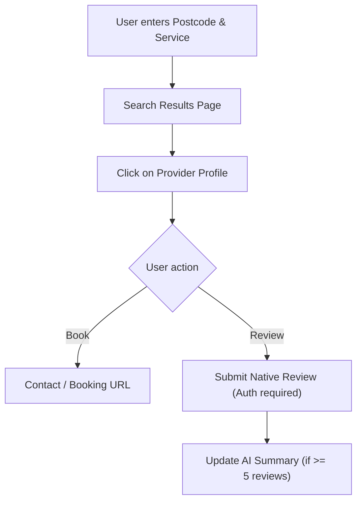

## 1. Product Overview
PawFinder2 is a UK pet services directory web app helping pet owners find vets, groomers, walkers, kennels, and pet shops based on postcode, animal type, breed, and service. 
- It features a unique review system capturing breed-specific temperament and handling data, setting it apart from generic directories like Google or Yell.
- The platform provides a trusted, curated space for pet owners while offering businesses tiered visibility and verification options.

## 2. Core Features

### 2.1 User Roles
| Role | Registration Method | Core Permissions |
|------|---------------------|------------------|
| Normal User | Email / Google Login | Browse listings, submit reviews with temperament tags |
| Business Owner | Claim Listing / Subscription | Manage profile, upload photos, view AI summaries |
| Admin | Role-gated | Trigger Postcode Seeding API to populate database |

### 2.2 Feature Module
1. **Home page**: Hero section with postcode search and animal type filters
2. **Search Results**: Filtered list of providers (free/unverified vs. verified/premium)
3. **Provider Profile**: Detailed view with native reviews, handling/environment ratings, AI summaries, and booking CTA
4. **Business Dashboard**: Profile management, claim verification, photo uploads, Stripe subscription management
5. **Admin Seed**: Tool to ingest data via Postcodes.io, Google Places, and DeepSeek

### 2.3 Page Details
| Page Name | Module Name | Feature description |
|-----------|-------------|---------------------|
| Home page | Search Hero | Postcode input, large animal-type selector with real photography |
| Search Results | Sidebar & List | Filter by category, service, breed, animal. Cards highlight verified status |
| Provider Profile | Native Reviews | Displays breed/temperament ratings. AI summary (5+ reviews). Live Google photos (if premium) |
| Business Dashboard | Subscription Management | Claim listing, upload Supabase Storage photos, manage Stripe tiers |
| Admin Seed | Ingestion Control | Enter postcode, trigger `/api/seed/postcode`, display ingestion results |

## 3. Core Process
A user searches for a service, views filtered results, selects a provider, and either books a service or leaves a detailed temperament-based review. Businesses can claim their listings and upgrade to paid tiers for better visibility.

## 4. User Interface Design
### 4.1 Design Style
- **Colors**: Warm neutrals (cream, soft terracotta, sage green) to evoke trust and calm.
- **Typography**: Friendly rounded sans-serif for headings (e.g., Nunito or Quicksand), clean readable body font.
- **Imagery**: Photography-led with real images of pets; avoid generic SaaS illustrations.
- **Badges**: Distinct but non-intrusive small gold/green checkmarks for verified/paid listings.

### 4.2 Page Design Overview
| Page Name | Module Name | UI Elements |
|-----------|-------------|-------------|
| Home page | Hero section | Warm background colors, rounded fonts, real pet photos, clear search inputs |
| Search Results | Provider Cards | Free listings have placeholder images; Premium listings feature Google photos and badges |
| Provider Profile | Review Section | Visual ratings (1-5) for handling and environment, tags for temperament |

### 4.3 Responsiveness
Mobile-first design approach (as most "near me" searches happen on mobile), adapting seamlessly to desktop layouts.
