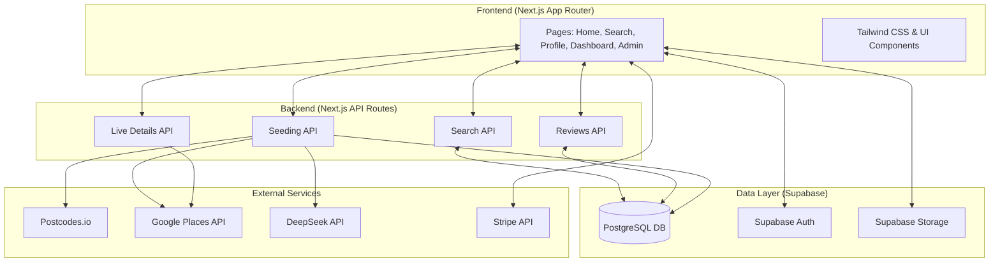
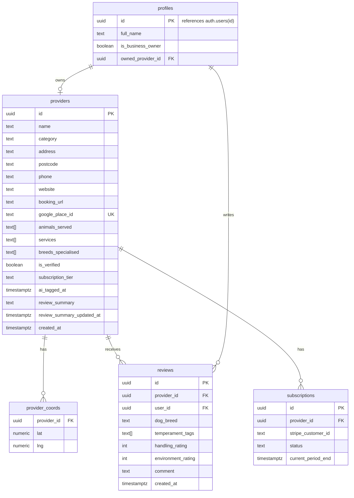

## 1. Architecture Design

## 2. Technology Description
- **Frontend/Backend**: Next.js 14+ (App Router)
- **Styling**: Tailwind CSS
- **Database/Auth/Storage**: Supabase
- **Payments**: Stripe Checkout
- **External APIs**: Google Places, DeepSeek, Postcodes.io

## 3. Route Definitions
| Route | Purpose |
|-------|---------|
| `/` | Home page |
| `/search` | Search results page |
| `/provider/[id]` | Provider profile page |
| `/business/dashboard` | Business owner portal |
| `/business/subscribe` | Stripe pricing/checkout page |
| `/admin/seed` | Internal data seeding tool |

## 4. API Definitions
| Endpoint | Method | Purpose |
|----------|--------|---------|
| `/api/seed/postcode` | POST | Admin: trigger Postcodes.io, Google Places, DeepSeek ingestion |
| `/api/providers/search` | GET | Search providers using pure Supabase queries |
| `/api/providers/[id]/live-details` | GET | Fetch live Google Places data (Photos/Reviews) for Premium tiers |
| `/api/reviews` | POST | Submit native review |
| `/api/reviews/[providerId]/ai-summary` | POST | Generate AI summary via DeepSeek if >= 5 reviews |

## 5. Data Model

### 5.1 Data Model Definition

